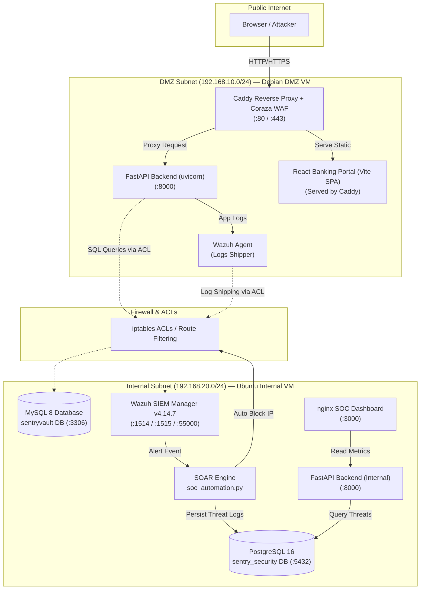

# SentryVault — Enterprise Secure Banking Portal & SOC Lab

[](https://fastapi.tiangolo.com)
[](https://vitejs.dev)
[](https://mysql.com)
[](https://postgresql.org)
[](#-wazuh-siem--active-response)
[](https://nginx.org)
[](LICENSE)

**SentryVault** is an enterprise-grade online banking application combined with a full cybersecurity SOC (Security Operations Center) lab environment. It operates inside a segmented multi-VM DMZ layout behind a Caddy reverse proxy, Coraza Web Application Firewall (WAF), Suricata NIDS, and a centralized Wazuh SIEM with automated SOAR incident response.

---

## 📖 Table of Contents

- [What is SentryVault?](#-what-is-sentryvault)
- [Live Network Architecture](#-live-network-architecture)
- [VM Topology & Services](#-vm-topology--services)
- [Key Security Features](#-key-security-features)
- [Tech Stack](#-tech-stack)
- [Database Schemas](#-database-schemas)
- [Wazuh SIEM & Active Response](#-wazuh-siem--active-response)
- [SOAR Automation](#-soar-automation)
- [API Reference](#-api-reference)
- [Demo Vulnerability Lab](#-demo-vulnerability-lab)
- [Deployment Guide](#-deployment-guide)
- [Default Credentials](#-default-credentials)
- [Project Structure](#-project-structure)
- [Verification Matrix](#-verification-matrix)

---

## 🏦 What is SentryVault?

**SentryVault** is a **production-style, full-stack cybersecurity lab** built around a realistic core banking application. It demonstrates end-to-end enterprise security architecture across a segmented multi-VM network — from the public DMZ to the internal corporate server — with live SIEM monitoring, automated threat response, and a dedicated SOC dashboard.

> [!NOTE]
> Built to demonstrate **real-world DevSecOps & Security Operations skills**: network segmentation, firewall ACLs, SIEM integration, WAF deployment, SOAR automation, and secure full-stack web application development.

---

## 🌐 Live Network Architecture

The architecture uses zero-trust principles, isolating public-facing services in a **DMZ Subnet (`192.168.10.0/24`)** while protecting sensitive databases, SIEM managers, and internal tools inside an **Internal Subnet (`192.168.20.0/24`)**.



---

## 🖥️ VM Topology & Services

| VM Node | IP Address | Subnet | Key Services & Roles |
|---|---|---|---|
| **Debian DMZ VM** | `192.168.10.10` | `192.168.10.0/24` | • Caddy Reverse Proxy & Coraza WAF (`:80`, `:443`)<br>• React Banking Portal SPA<br>• FastAPI Application Backend (`:8000`)<br>• Wazuh Log Collector Agent (`:1514`) |
| **Ubuntu Internal VM** | `192.168.20.10` | `192.168.20.0/24` | • MySQL 8 Application Database (`:3306`)<br>• PostgreSQL 16 SOC/Security Database (`:5432`)<br>• Wazuh SIEM Manager v4.14.7 (`:1514`, `:1515`, `:55000`)<br>• SOAR Threat Automation Engine<br>• Nginx SOC Security Dashboard (`:3000`) |

---

## 🔐 Key Security Features

| Component | Security Feature | Implementation Details |
|---|---|---|
| **WAF Protection** | Coraza WAF + OWASP CRS | Blocks SQLi, XSS, Path Traversal, and Command Injection at the Caddy edge proxy. |
| **Auth & Access Control** | JWT + RBAC | RS256 signed JWTs with bcrypt password hashing; strict `ADMIN` vs `CUSTOMER` roles. |
| **SIEM Telemetry** | Wazuh Manager v4.14.7 | Real-time JSON application log ingestion, file integrity monitoring (FIM), and rootkit analysis. |
| **SOAR Automation** | Automated IP Quarantine | `active_response_block.py` automatically blocks offending IPs via `iptables` upon High/Critical alerts (severity ≥ 8). |
| **Network ACLs** | Strict `iptables` Firewall | Scoped ACCEPT rules restricting internal MySQL (`:3306`) and Wazuh Manager (`:1514`) access strictly to DMZ IPs. |
| **Structured Logging** | Wazuh-Compatible JSON | All application actions, auth attempts, and transaction logs are output as structured JSON objects. |
| **Vulnerability Lab** | Toggleable `DEMO_MODE` | Safe endpoint suite under `/demo/*` to simulate attacks and validate SIEM & WAF detection rules. |

---

## 🛠️ Tech Stack

| Layer | Technology | Version | Description |
|---|---|---|---|
| **Frontend** | React + Vite | 18.x / 5.x | Banking Portal SPA + SOC Dashboard |
| **Styling** | TailwindCSS | 3.x | Clean, responsive core-banking interface |
| **Backend** | FastAPI + uvicorn | 0.10x | Async REST API, JWT auth, Pydantic schemas |
| **ORM & Migrations** | SQLAlchemy + Alembic | 2.x | Database models and schema management |
| **Application DB** | MySQL 8 | 8.x | Persistent core banking data (`sentryvault`) |
| **Security DB** | PostgreSQL 16 | 16.x | Security event store (`sentry_security`) |
| **Reverse Proxy & WAF** | Caddy + Coraza | v2 | Edge TLS termination & OWASP WAF filtering |
| **SIEM Engine** | Wazuh Manager | v4.14.7 | Log aggregation, correlation, and alerting |
| **SOAR Engine** | Python 3 + `psycopg2` | 3.12 | Automated threat response CLI & firewall controller |
| **Web Server** | Nginx | 1.24 | Serving SOC Dashboard SPA on port 3000 |

---

## 🗄️ Database Schemas

### MySQL — `sentryvault` (Core Application DB)
* `users` — User credentials, roles (`ADMIN`, `CUSTOMER`), and profile data.
* `accounts` — Savings/Current account details, balances, IFSC codes, and statuses.
* `transactions` — Ledger records, source/target IDs, amounts, reference tokens, and timestamps.
* `beneficiaries` — Saved recipient accounts for fast fund transfers.
* `notifications` — System messages and alert notifications.
* `audit_logs` — User activity logs with IP addresses and user agents.

> **Default Seed Data:** 5 pre-configured users, 10 accounts, 100 transactions, and 10 beneficiaries.

### PostgreSQL — `sentry_security` (SOC / SOAR DB)
* `threat_events` — Ingested SIEM alerts, threat types, severities, and raw payloads.
* `blocked_ips` — Quarantined IP addresses, block reason, timestamp, and active status.
* `waf_alerts` — Coraza WAF trigger logs, attack vectors, and target URLs.
* `soc_metrics` — Real-time Security Operations Center KPIs and metrics.

---

## 📡 Wazuh SIEM & Active Response

Wazuh Manager **v4.14.7** runs on the Internal VM (`192.168.20.10`) and ingests telemetry from DMZ agents:

| Port | Protocol | Purpose |
|---|---|---|
| `1514` | TCP / UDP | Agent log shipping & syslog collection |
| `1515` | TCP | Agent registration service |
| `55000` | TCP | Wazuh Manager REST API |

### Active Response Workflow

When an alert with severity **≥ 8 (HIGH / CRITICAL)** is detected:

```
Wazuh Alert Triggered
      │
      ▼
active_response_block.py (Reads JSON alert from stdin)
      │
      ├──> iptables -I INPUT 1 -s <SOURCE_IP> -j DROP
      │
      └──> soc_automation.py --alert '<JSON>'
               │
               └──> PostgreSQL: INSERT INTO threat_events & blocked_ips
```

---

## ⚡ SOAR Automation

The [`scripts/soc_automation.py`](scripts/soc_automation.py) script provides a complete CLI interface for Security Operations:

```bash
# Test PostgreSQL database connection
python3 scripts/soc_automation.py --test

# List recorded threat events
python3 scripts/soc_automation.py --list-threats

# List active blocked IPs
python3 scripts/soc_automation.py --list-blocked

# Manually quarantine an IP address via iptables & DB
python3 scripts/soc_automation.py --block-ip 192.168.10.99

# Unblock a quarantined IP address
python3 scripts/soc_automation.py --unblock-ip 192.168.10.99

# Manually process a Wazuh JSON alert payload
python3 scripts/soc_automation.py --alert '{"rule":{"level":12,"description":"Brute force attack","groups":["BRUTE_FORCE"]},"data":{"srcip":"10.0.0.55"}}'
```

---

## 📚 API Reference

Base REST API URL: `http://<HOST>:8000/api/v1`

| Method | Endpoint | Auth | Description |
|---|---|---|---|
| `POST` | `/auth/login` | Public | Authenticate user and return JWT token |
| `POST` | `/auth/register` | Public | Register new customer account |
| `GET` | `/accounts/` | Authenticated | List accounts belonging to current user |
| `GET` | `/accounts/{id}` | Authenticated | Retrieve detailed account info & balance |
| `POST` | `/transactions/transfer` | Authenticated | Execute an atomic fund transfer |
| `GET` | `/transactions/` | Authenticated | Search & filter paginated transaction history |
| `GET` | `/beneficiaries/` | Authenticated | Retrieve beneficiary list |
| `POST` | `/beneficiaries/` | Authenticated | Save a new transfer recipient |
| `GET` | `/profile/me` | Authenticated | Retrieve current user profile |
| `PUT` | `/profile/password` | Authenticated | Change user password |
| `GET` | `/admin/stats` | Admin Only | View system-wide metrics |
| `GET` | `/admin/audit-logs` | Admin Only | Inspect global audit trail |
| `GET` | `/demo/sqli` | Public (Demo) | Simulated SQL Injection vulnerability |
| `GET` | `/demo/xss` | Public (Demo) | Simulated Reflected XSS vulnerability |
| `GET` | `/demo/path-traversal` | Public (Demo) | Simulated Path Traversal vulnerability |
| `POST` | `/demo/brute-force` | Public (Demo) | Simulated Authentication Brute Force |

> [!TIP]
> Interactive **Swagger UI** documentation is accessible at `http://<HOST>:8000/docs` when `DEMO_MODE=true`.

---

## 🧪 Demo Vulnerability Lab

When `DEMO_MODE=true`, controlled vulnerable endpoints are exposed for WAF and SIEM rule testing:

| Endpoint | Attack Category | Triggered Wazuh Rule | Expected Action |
|---|---|---|---|
| `GET /demo/sqli?id=<payload>` | SQL Injection | Rule `31100` | WAF 403 Block & SIEM Alert |
| `GET /demo/xss?msg=<payload>` | Reflected XSS | Rule `31101` | WAF 403 Block & SIEM Alert |
| `GET /demo/path-traversal?file=<path>` | Path Traversal (LFI) | Rule `31102` | WAF 403 Block & SIEM Alert |
| `POST /demo/brute-force` | Auth Brute Force | Rule `31103` | Rate-limit Throttle & SIEM Alert |

> [!WARNING]
> Always set `DEMO_MODE=false` in production environments. When disabled, all `/demo/*` endpoints return `404 Not Found`.

---

## 🚀 Deployment Guide

### Option 1: Multi-VM Production Layout

```bash
# 1. Setup Debian DMZ VM (192.168.10.10)
git clone https://github.com/abhienix/SentryVault.git
cd SentryVault/deployment
sudo bash setup_debian_dmz_vm.sh

# 2. Setup Ubuntu Internal VM (192.168.20.10)
git clone https://github.com/abhienix/SentryVault.git
cd SentryVault/deployment
sudo bash setup_internal_server.sh

# 3. Test Cross-Subnet Connectivity
ping -c 3 192.168.10.10
mysql -u sentryuser -pSecureDbPassword123! -h 192.168.20.10 sentryvault -e "SELECT 1;"
```

### Option 2: Local Docker Compose (Development)

```bash
git clone https://github.com/abhienix/SentryVault.git
cd SentryVault
cp .env.example .env
docker-compose up -d --build
docker-compose exec backend python scripts/seed_data.py
```

* **Frontend App**: `http://localhost:3000` (or `http://localhost:5173`)
* **API Documentation**: `http://localhost:8000/docs`

---

## 🔑 Default Credentials

| Service | Username | Password | Access Location |
|---|---|---|---|
| **Banking Customer** | `john_doe` | `Password123!` | Banking Portal (`:3000`) |
| **Banking Customer** | `jane_smith` | `Password123!` | Banking Portal (`:3000`) |
| **Banking Admin** | `admin` | `Password123!` | Admin Dashboard (`:3000`) |
| **MySQL Database** | `sentryuser` | `SecureDbPassword123!` | `192.168.20.10:3306` |
| **PostgreSQL Database** | `sentry_soc` | `SocSecurityPass123!` | `127.0.0.1:5432` |
| **Wazuh Manager API** | `wazuh-wui` | `MyS3cr37P450r.*-` | `https://192.168.20.10:55000` |

> [!CAUTION]
> Remember to change default passwords before deploying to public or untrusted networks.

---

## 📁 Project Structure

```text
SentryVault/
├── backend/                    # FastAPI Application
│   ├── app/
│   │   ├── api/routers/        # Auth, Accounts, Transactions, Admin, Demo
│   │   ├── core/               # Configuration, Security, Logging
│   │   ├── database/           # SQLAlchemy session & engine
│   │   ├── models/             # ORM database models
│   │   └── schemas/            # Pydantic data validation schemas
│   ├── alembic/                # Database migrations
│   └── requirements.txt
│
├── frontend/                   # React + Vite Banking Portal
│   └── src/
│       ├── pages/              # Dashboard, Accounts, Transfer, Admin, Demo
│       ├── components/         # Navbar, Sidebar, StatCards, Modals
│       └── services/           # Axios API client & interceptors
│
├── database/
│   ├── init.sql                # MySQL initial schema
│   └── sentry_security_schema.sql # PostgreSQL SOC DB schema
│
├── scripts/
│   ├── seed_data.py            # MySQL data seeder
│   ├── soc_automation.py       # SOAR CLI automation tool
│   └── active_response_block.py # Wazuh Active Response IP blocker
│
├── deployment/
│   ├── setup_internal_server.sh # Master Internal VM setup script
│   ├── setup_debian_dmz_vm.sh   # DMZ VM setup script
│   ├── caddy-debian-dmz.Caddyfile # Caddy + Coraza WAF configuration
│   └── sentryvault-backend.service # systemd unit file
│
├── docs/                       # Architecture diagrams & documentation
├── docker-compose.yml          # Containerized local dev stack
└── README.md
```

---

## ✅ Internal Server Verification Matrix

| Verification Check | Target / Endpoint | Result |
|---|---|---|
| **Network Interface** | IP `192.168.20.10` assigned | `PASS` |
| **Subnet Routing** | DMZ `192.168.10.10` ping response | `PASS` (1.7ms RTT) |
| **Database Bind** | MySQL listening on `0.0.0.0:3306` | `PASS` |
| **DMZ DB Auth** | Remote `sentryuser` login from DMZ | `PASS` |
| **DB Seeding** | 5 Users / 10 Accounts / 100 Transactions | `PASS` |
| **Wazuh Engine** | Manager v4.14.7 listening on ports `1514/1515/55000` | `PASS` |
| **Security DB** | PostgreSQL `sentry_security` schema ready | `PASS` |
| **SOAR Script** | `soc_automation.py` database writes verified | `PASS` |
| **SOC Dashboard** | Nginx serving React SPA on `:3000` | `PASS` (HTTP 200) |
| **FastAPI Service** | Backend API running on `:8000` | `PASS` (ONLINE) |
| **Firewall Rules** | `iptables` ACLs applied & persisted | `PASS` |

---

**Maintained by [@abhienix](https://github.com/abhienix)** · *Built for Security Research & DevSecOps Demonstration*
