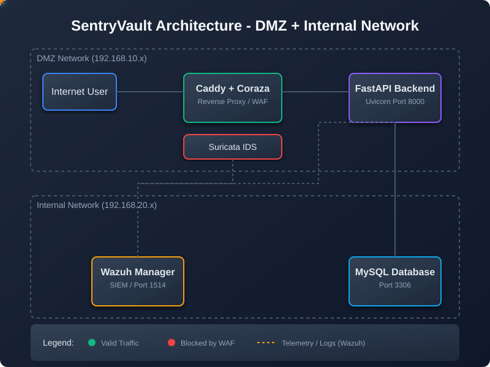

<div align="center">

<!-- Animated Banner SVG -->
<svg xmlns="http://www.w3.org/2000/svg" viewBox="0 0 900 200" width="900" height="200">
  <defs>
    <linearGradient id="bg" x1="0%" y1="0%" x2="100%" y2="100%">
      <stop offset="0%" style="stop-color:#0a0f1e"/>
      <stop offset="100%" style="stop-color:#0d1b3e"/>
    </linearGradient>
    <linearGradient id="accent" x1="0%" y1="0%" x2="100%" y2="0%">
      <stop offset="0%" style="stop-color:#00d4ff"/>
      <stop offset="50%" style="stop-color:#7b2fff"/>
      <stop offset="100%" style="stop-color:#00d4ff"/>
    </linearGradient>
    <filter id="glow">
      <feGaussianBlur stdDeviation="3" result="blur"/>
      <feMerge><feMergeNode in="blur"/><feMergeNode in="SourceGraphic"/></feMerge>
    </filter>
    <style>
      .title { font: bold 42px 'Segoe UI', sans-serif; fill: #fff; filter: url(#glow); }
      .sub   { font: 16px 'Segoe UI', sans-serif; fill: #94a3b8; }
      .badge { font: bold 11px monospace; }
      .pulse { animation: pulse 2s ease-in-out infinite; }
      .slide { animation: slide 3s ease-out forwards; }
      .glow-line { animation: glowMove 4s linear infinite; }
      @keyframes pulse { 0%,100%{opacity:.6} 50%{opacity:1} }
      @keyframes slide { from{opacity:0;transform:translateY(20px)} to{opacity:1;transform:translateY(0)} }
      @keyframes glowMove { 0%{stop-color:#00d4ff} 50%{stop-color:#7b2fff} 100%{stop-color:#00d4ff} }
    </style>
  </defs>
  <rect width="900" height="200" fill="url(#bg)" rx="12"/>
  <!-- animated border -->
  <rect x="2" y="2" width="896" height="196" fill="none" stroke="url(#accent)" stroke-width="2" rx="11" opacity="0.6" class="pulse"/>
  <!-- shield icon -->
  <g transform="translate(60,100)" class="slide">
    <path d="M0-55 L45-35 L45 20 Q45 55 0 70 Q-45 55 -45 20 L-45-35Z" fill="none" stroke="#00d4ff" stroke-width="2.5" opacity="0.9"/>
    <path d="M0-40 L30-25 L30 18 Q30 45 0 56 Q-30 45 -30 18 L-30-25Z" fill="#00d4ff" opacity="0.15"/>
    <text x="0" y="8" text-anchor="middle" font-size="22" fill="#00d4ff" font-weight="bold">SV</text>
  </g>
  <!-- title -->
  <text x="130" y="90" class="title slide">SentryVault</text>
  <text x="132" y="118" class="sub slide">Enterprise-Grade Secure Banking Portal · Full-Stack SOC Lab</text>
  <!-- tags -->
  <g transform="translate(132,142)" class="slide">
    <rect width="80" height="22" rx="4" fill="#00d4ff" opacity="0.2"/>
    <text x="40" y="15" text-anchor="middle" class="badge" fill="#00d4ff">FastAPI</text>
    <rect x="88" width="70" height="22" rx="4" fill="#7b2fff" opacity="0.2"/>
    <text x="123" y="15" text-anchor="middle" class="badge" fill="#a78bfa">React+Vite</text>
    <rect x="166" width="66" height="22" rx="4" fill="#f59e0b" opacity="0.2"/>
    <text x="199" y="15" text-anchor="middle" class="badge" fill="#fbbf24">MySQL 8</text>
    <rect x="240" width="78" height="22" rx="4" fill="#10b981" opacity="0.2"/>
    <text x="279" y="15" text-anchor="middle" class="badge" fill="#34d399">Wazuh SIEM</text>
    <rect x="326" width="70" height="22" rx="4" fill="#ef4444" opacity="0.2"/>
    <text x="361" y="15" text-anchor="middle" class="badge" fill="#f87171">SOAR/IDS</text>
    <rect x="404" width="80" height="22" rx="4" fill="#06b6d4" opacity="0.2"/>
    <text x="444" y="15" text-anchor="middle" class="badge" fill="#22d3ee">PostgreSQL</text>
  </g>
  <!-- network dots -->
  <g class="pulse">
    <circle cx="810" cy="60" r="4" fill="#00d4ff" opacity="0.8"/>
    <circle cx="830" cy="90" r="3" fill="#7b2fff" opacity="0.7"/>
    <circle cx="800" cy="110" r="5" fill="#00d4ff" opacity="0.5"/>
    <circle cx="850" cy="70" r="3" fill="#10b981" opacity="0.8"/>
    <line x1="810" y1="60" x2="830" y2="90" stroke="#00d4ff" stroke-width="1" opacity="0.4"/>
    <line x1="830" y1="90" x2="800" y2="110" stroke="#7b2fff" stroke-width="1" opacity="0.4"/>
    <line x1="810" y1="60" x2="850" y2="70" stroke="#10b981" stroke-width="1" opacity="0.4"/>
    <line x1="850" y1="70" x2="830" y2="90" stroke="#00d4ff" stroke-width="1" opacity="0.4"/>
  </g>
</svg>

<br/>

[](https://fastapi.tiangolo.com)
[](https://vitejs.dev)
[](https://mysql.com)
[](https://postgresql.org)
[](#wazuh-siem)
[](https://nginx.org)
[](LICENSE)

</div>

---

## 📖 Table of Contents

- [What is SentryVault?](#-what-is-sentryvault)
- [Live Network Architecture](#-live-network-architecture)
- [VM Topology & Services](#-vm-topology--services)
- [Security Features](#-security-features)
- [Tech Stack](#-tech-stack)
- [Database Schemas](#-database-schemas)
- [Wazuh SIEM & Active Response](#-wazuh-siem--active-response)
- [SOAR Automation](#-soar-automation)
- [API Reference](#-api-reference)
- [Demo Vulnerability Lab](#-demo-vulnerability-lab)
- [Deployment Guide](#-deployment-guide)
- [Default Credentials](#-default-credentials)
- [Project Structure](#-project-structure)

---

## 🏦 What is SentryVault?

**SentryVault** is a **production-style, full-stack cybersecurity lab** built around a realistic core banking application. It demonstrates end-to-end enterprise security architecture across a segmented multi-VM network — from the DMZ to the internal server — with live SIEM monitoring, automated threat response, and a SOC dashboard.

> Built to showcase **real-world DevSecOps skills**: network segmentation, firewall ACLs, SIEM integration, WAF deployment, SOAR automation, and secure full-stack development.

---

## 🌐 Live Network Architecture

<!-- Network Architecture SVG -->
<div align="center">
<svg xmlns="http://www.w3.org/2000/svg" viewBox="0 0 860 480" width="860" height="480">
  <defs>
    <linearGradient id="dmzGrad" x1="0%" y1="0%" x2="0%" y2="100%">
      <stop offset="0%" style="stop-color:#1a1040"/>
      <stop offset="100%" style="stop-color:#0f172a"/>
    </linearGradient>
    <linearGradient id="intGrad" x1="0%" y1="0%" x2="0%" y2="100%">
      <stop offset="0%" style="stop-color:#0a1628"/>
      <stop offset="100%" style="stop-color:#0f172a"/>
    </linearGradient>
    <style>
      .zone-label { font: bold 12px monospace; }
      .ip { font: 11px monospace; }
      .svc { font: 10px 'Segoe UI', sans-serif; }
      .box-title { font: bold 13px 'Segoe UI', sans-serif; }
      .flow { animation: dash 2s linear infinite; stroke-dasharray: 8 4; }
      .flow2 { animation: dash2 3s linear infinite; stroke-dasharray: 6 4; }
      .blink { animation: blink 1.5s step-start infinite; }
      @keyframes dash { to { stroke-dashoffset: -36; } }
      @keyframes dash2 { to { stroke-dashoffset: -40; } }
      @keyframes blink { 50% { opacity: 0; } }
    </style>
  </defs>

  <!-- Background -->
  <rect width="860" height="480" fill="#0a0f1e" rx="14"/>

  <!-- Internet Zone -->
  <rect x="20" y="20" width="120" height="440" fill="#1e293b" rx="8" opacity="0.6"/>
  <text x="80" y="44" text-anchor="middle" class="zone-label" fill="#64748b">INTERNET</text>
  <rect x="35" y="60" width="90" height="50" rx="6" fill="#334155"/>
  <text x="80" y="80" text-anchor="middle" class="box-title" fill="#94a3b8">Browser</text>
  <text x="80" y="96" text-anchor="middle" class="svc" fill="#64748b">User / Attacker</text>

  <!-- DMZ Zone -->
  <rect x="160" y="20" width="240" height="440" fill="#1a1040" rx="8" opacity="0.7"/>
  <text x="280" y="44" text-anchor="middle" class="zone-label" fill="#a78bfa">DMZ  192.168.10.0/24</text>

  <!-- Caddy+WAF box -->
  <rect x="175" y="60" width="210" height="80" rx="7" fill="#2d1b69" stroke="#7c3aed" stroke-width="1.5"/>
  <text x="280" y="82" text-anchor="middle" class="box-title" fill="#c4b5fd">Caddy Rev. Proxy</text>
  <text x="280" y="98" text-anchor="middle" class="svc" fill="#a78bfa">+ Coraza WAF</text>
  <text x="280" y="113" text-anchor="middle" class="ip" fill="#7c3aed">192.168.10.10 :80/:443</text>
  <circle cx="360" cy="70" r="5" fill="#7c3aed" class="blink"/>

  <!-- FastAPI box -->
  <rect x="175" y="165" width="210" height="80" rx="7" fill="#1e3a5f" stroke="#3b82f6" stroke-width="1.5"/>
  <text x="280" y="187" text-anchor="middle" class="box-title" fill="#93c5fd">FastAPI Backend</text>
  <text x="280" y="203" text-anchor="middle" class="svc" fill="#60a5fa">uvicorn · 4 workers</text>
  <text x="280" y="218" text-anchor="middle" class="ip" fill="#3b82f6">:8000  · JWT Auth · RBAC</text>

  <!-- Wazuh Agent box -->
  <rect x="175" y="270" width="210" height="70" rx="7" fill="#1a2e1a" stroke="#22c55e" stroke-width="1.5"/>
  <text x="280" y="292" text-anchor="middle" class="box-title" fill="#86efac">Wazuh Agent</text>
  <text x="280" y="308" text-anchor="middle" class="svc" fill="#4ade80">Ships logs → Manager</text>
  <text x="280" y="323" text-anchor="middle" class="ip" fill="#22c55e">:1514 UDP/TCP</text>

  <!-- React Frontend box -->
  <rect x="175" y="360" width="210" height="70" rx="7" fill="#1a2a3a" stroke="#06b6d4" stroke-width="1.5"/>
  <text x="280" y="382" text-anchor="middle" class="box-title" fill="#67e8f9">React Frontend</text>
  <text x="280" y="398" text-anchor="middle" class="svc" fill="#22d3ee">Vite · TailwindCSS</text>
  <text x="280" y="413" text-anchor="middle" class="ip" fill="#06b6d4">SPA served by Caddy</text>

  <!-- Firewall divider -->
  <rect x="430" y="20" width="50" height="440" fill="#1e1a00" rx="6" opacity="0.8"/>
  <text x="455" y="240" text-anchor="middle" class="zone-label" fill="#fbbf24" transform="rotate(-90,455,240)">FIREWALL · iptables ACL</text>
  <rect x="432" y="22" width="46" height="436" fill="none" stroke="#f59e0b" stroke-width="1" rx="5" stroke-dasharray="6 3" class="flow2"/>

  <!-- Internal Zone -->
  <rect x="500" y="20" width="340" height="440" fill="#0a1628" rx="8" opacity="0.8"/>
  <text x="670" y="44" text-anchor="middle" class="zone-label" fill="#38bdf8">INTERNAL  192.168.20.0/24</text>

  <!-- MySQL box -->
  <rect x="515" y="60" width="150" height="80" rx="7" fill="#172554" stroke="#3b82f6" stroke-width="1.5"/>
  <text x="590" y="82" text-anchor="middle" class="box-title" fill="#93c5fd">MySQL 8</text>
  <text x="590" y="98" text-anchor="middle" class="svc" fill="#60a5fa">sentryvault DB</text>
  <text x="590" y="113" text-anchor="middle" class="ip" fill="#3b82f6">0.0.0.0:3306</text>

  <!-- Wazuh Manager box -->
  <rect x="680" y="60" width="145" height="80" rx="7" fill="#14291a" stroke="#22c55e" stroke-width="1.5"/>
  <text x="752" y="82" text-anchor="middle" class="box-title" fill="#86efac">Wazuh Manager</text>
  <text x="752" y="98" text-anchor="middle" class="svc" fill="#4ade80">v4.14.7 · SIEM</text>
  <text x="752" y="113" text-anchor="middle" class="ip" fill="#22c55e">:1514 :1515 :55000</text>
  <circle cx="818" cy="70" r="5" fill="#22c55e" class="blink"/>

  <!-- PostgreSQL box -->
  <rect x="515" y="165" width="150" height="80" rx="7" fill="#1e1b4b" stroke="#818cf8" stroke-width="1.5"/>
  <text x="590" y="187" text-anchor="middle" class="box-title" fill="#c7d2fe">PostgreSQL 16</text>
  <text x="590" y="203" text-anchor="middle" class="svc" fill="#a5b4fc">sentry_security DB</text>
  <text x="590" y="218" text-anchor="middle" class="ip" fill="#818cf8">127.0.0.1:5432</text>

  <!-- SOAR box -->
  <rect x="680" y="165" width="145" height="80" rx="7" fill="#2d1515" stroke="#ef4444" stroke-width="1.5"/>
  <text x="752" y="187" text-anchor="middle" class="box-title" fill="#fca5a5">SOAR Engine</text>
  <text x="752" y="203" text-anchor="middle" class="svc" fill="#f87171">soc_automation.py</text>
  <text x="752" y="218" text-anchor="middle" class="ip" fill="#ef4444">iptables AUTO-BLOCK</text>

  <!-- nginx/Dashboard box -->
  <rect x="515" y="270" width="310" height="70" rx="7" fill="#0d2d1a" stroke="#10b981" stroke-width="1.5"/>
  <text x="670" y="292" text-anchor="middle" class="box-title" fill="#6ee7b7">nginx · SOC Dashboard</text>
  <text x="670" y="308" text-anchor="middle" class="svc" fill="#34d399">React SPA · proxy → FastAPI :8000</text>
  <text x="670" y="323" text-anchor="middle" class="ip" fill="#10b981">192.168.20.10:3000</text>

  <!-- FastAPI Internal box -->
  <rect x="515" y="360" width="310" height="70" rx="7" fill="#1e3a5f" stroke="#3b82f6" stroke-width="1.5"/>
  <text x="670" y="382" text-anchor="middle" class="box-title" fill="#93c5fd">FastAPI Backend (Internal)</text>
  <text x="670" y="398" text-anchor="middle" class="svc" fill="#60a5fa">MySQL sentryvault · Wazuh logs</text>
  <text x="670" y="413" text-anchor="middle" class="ip" fill="#3b82f6">192.168.20.10:8000</text>

  <!-- Flow arrows: Internet → Caddy -->
  <line x1="125" y1="88" x2="175" y2="100" stroke="#7c3aed" stroke-width="2" class="flow" marker-end="url(#arr)"/>
  <!-- Caddy → FastAPI -->
  <line x1="280" y1="140" x2="280" y2="165" stroke="#3b82f6" stroke-width="2" class="flow"/>
  <!-- FastAPI → Wazuh Agent -->
  <line x1="280" y1="245" x2="280" y2="270" stroke="#22c55e" stroke-width="2" class="flow2"/>
  <!-- FastAPI → MySQL (cross firewall) -->
  <path d="M385 205 Q415 205 430 205 Q455 205 480 205 Q490 205 515 205" stroke="#3b82f6" stroke-width="2" fill="none" class="flow"/>
  <!-- Wazuh Agent → Wazuh Manager (cross firewall) -->
  <path d="M385 305 Q415 305 430 305 Q455 305 480 305 Q495 295 700 100" stroke="#22c55e" stroke-width="2" fill="none" class="flow2"/>
  <!-- MySQL → SOAR -->
  <line x1="665" y1="205" x2="680" y2="205" stroke="#ef4444" stroke-width="2" class="flow2"/>
  <!-- SOAR → PostgreSQL -->
  <line x1="752" y1="245" x2="752" y2="265 " stroke="#818cf8" stroke-width="2" class="flow2"/>
  <line x1="752" y1="265" x2="590" y2="265" stroke="#818cf8" stroke-width="2" class="flow2"/>
  <line x1="590" y1="265" x2="590" y2="245" stroke="#818cf8" stroke-width="2" class="flow2"/>
  <!-- nginx → FastAPI Internal -->
  <line x1="670" y1="340" x2="670" y2="360" stroke="#10b981" stroke-width="2" class="flow"/>
</svg>
</div>

---

## 🖥️ VM Topology & Services

<!-- VM Topology SVG -->
<div align="center">
<svg xmlns="http://www.w3.org/2000/svg" viewBox="0 0 800 220" width="800" height="220">
  <defs>
    <style>
      .vm-title { font: bold 14px 'Segoe UI', sans-serif; }
      .vm-ip    { font: bold 12px monospace; }
      .vm-svc   { font: 11px 'Segoe UI', sans-serif; }
      .ping     { animation: pingAnim 1.5s ease-in-out infinite; }
      @keyframes pingAnim {
        0%   { r: 4; opacity: 1; }
        100% { r: 20; opacity: 0; }
      }
    </style>
  </defs>
  <rect width="800" height="220" fill="#0a0f1e" rx="12"/>

  <!-- VM1: Debian DMZ -->
  <rect x="20" y="20" width="350" height="180" rx="10" fill="#1a1040" stroke="#7c3aed" stroke-width="2"/>
  <rect x="20" y="20" width="350" height="38" rx="10" fill="#2d1b69"/>
  <rect x="20" y="46" width="350" height="12" fill="#2d1b69"/>
  <text x="195" y="44" text-anchor="middle" class="vm-title" fill="#c4b5fd">Debian DMZ VM</text>
  <text x="195" y="68" text-anchor="middle" class="vm-ip" fill="#a78bfa">192.168.10.10</text>

  <text x="40" y="95"  class="vm-svc" fill="#94a3b8">● Caddy Reverse Proxy + Coraza WAF  :80/:443</text>
  <text x="40" y="113" class="vm-svc" fill="#94a3b8">● FastAPI Backend (uvicorn)          :8000</text>
  <text x="40" y="131" class="vm-svc" fill="#94a3b8">● Wazuh Agent → ships JSON logs      :1514</text>
  <text x="40" y="149" class="vm-svc" fill="#94a3b8">● React SPA (Vite + TailwindCSS)     CDN/Static</text>
  <text x="40" y="167" class="vm-svc" fill="#94a3b8">● Application Log → /var/log/sentryvault/</text>
  <text x="40" y="185" class="vm-svc" fill="#64748b">Subnet: 192.168.10.0/24</text>

  <!-- ping animation between VMs -->
  <circle cx="430" cy="110" r="4" fill="#00d4ff"/>
  <circle cx="430" cy="110" r="4" fill="none" stroke="#00d4ff" stroke-width="1.5" class="ping"/>
  <line x1="370" y1="110" x2="430" y2="110" stroke="#00d4ff" stroke-width="1.5" stroke-dasharray="5 3"/>
  <text x="430" y="100" text-anchor="middle" fill="#00d4ff" font-size="9" font-family="monospace">ping OK</text>
  <text x="430" y="125" text-anchor="middle" fill="#00d4ff" font-size="9" font-family="monospace">1.7ms RTT</text>
  <line x1="430" y1="110" x2="430" y2="110" stroke="#00d4ff" stroke-width="1.5" stroke-dasharray="5 3"/>
  <line x1="430" y1="110" x2="490" y2="110" stroke="#00d4ff" stroke-width="1.5" stroke-dasharray="5 3"/>

  <!-- VM2: Ubuntu Internal -->
  <rect x="430" y="20" width="350" height="180" rx="10" fill="#0a1628" stroke="#38bdf8" stroke-width="2"/>
  <rect x="430" y="20" width="350" height="38" rx="10" fill="#1e3a5f"/>
  <rect x="430" y="46" width="350" height="12" fill="#1e3a5f"/>
  <text x="605" y="44" text-anchor="middle" class="vm-title" fill="#93c5fd">Ubuntu Internal VM</text>
  <text x="605" y="68" text-anchor="middle" class="vm-ip" fill="#38bdf8">192.168.20.10</text>

  <text x="450" y="95"  class="vm-svc" fill="#94a3b8">● MySQL 8     sentryvault DB   0.0.0.0:3306</text>
  <text x="450" y="113" class="vm-svc" fill="#94a3b8">● PostgreSQL 16  sentry_security  :5432</text>
  <text x="450" y="131" class="vm-svc" fill="#94a3b8">● Wazuh Manager v4.14.7         :1514/:1515/:55000</text>
  <text x="450" y="149" class="vm-svc" fill="#94a3b8">● nginx  SOC Dashboard          :3000</text>
  <text x="450" y="167" class="vm-svc" fill="#94a3b8">● FastAPI Backend (internal)    :8000</text>
  <text x="450" y="185" class="vm-svc" fill="#64748b">Subnet: 192.168.20.0/24</text>
</svg>
</div>

---

## 🔐 Security Features

<!-- Security Features SVG -->
<div align="center">
<svg xmlns="http://www.w3.org/2000/svg" viewBox="0 0 820 280" width="820" height="280">
  <defs>
    <style>
      .feat-title { font: bold 13px 'Segoe UI', sans-serif; }
      .feat-desc  { font: 11px 'Segoe UI', sans-serif; }
      .card-anim  { animation: cardIn 0.6s ease-out both; }
      @keyframes cardIn { from{opacity:0;transform:translateY(15px)} to{opacity:1;transform:translateY(0)} }
    </style>
  </defs>
  <rect width="820" height="280" fill="#0a0f1e" rx="12"/>

  <!-- Card 1: WAF -->
  <rect x="15" y="20" width="180" height="115" rx="8" fill="#2d1b69" stroke="#7c3aed" stroke-width="1.5" class="card-anim" style="animation-delay:0s"/>
  <text x="32" y="46" class="feat-title" fill="#c4b5fd">🛡️ Coraza WAF</text>
  <text x="25" y="64"  class="feat-desc" fill="#a78bfa">OWASP Core Rule Set</text>
  <text x="25" y="80"  class="feat-desc" fill="#a78bfa">SQLi / XSS detection</text>
  <text x="25" y="96"  class="feat-desc" fill="#a78bfa">Path traversal block</text>
  <text x="25" y="112" class="feat-desc" fill="#a78bfa">Brute-force throttle</text>
  <text x="25" y="128" class="feat-desc" fill="#64748b">via Caddy + CRS rules</text>

  <!-- Card 2: Auth -->
  <rect x="205" y="20" width="180" height="115" rx="8" fill="#1e3a5f" stroke="#3b82f6" stroke-width="1.5" class="card-anim" style="animation-delay:0.1s"/>
  <text x="222" y="46" class="feat-title" fill="#93c5fd">🔑 JWT + RBAC</text>
  <text x="215" y="64"  class="feat-desc" fill="#60a5fa">bcrypt password hash</text>
  <text x="215" y="80"  class="feat-desc" fill="#60a5fa">RS256 JWT tokens</text>
  <text x="215" y="96"  class="feat-desc" fill="#60a5fa">24-hr expiry + refresh</text>
  <text x="215" y="112" class="feat-desc" fill="#60a5fa">ADMIN / CUSTOMER roles</text>
  <text x="215" y="128" class="feat-desc" fill="#64748b">pydantic-settings config</text>

  <!-- Card 3: SIEM -->
  <rect x="395" y="20" width="180" height="115" rx="8" fill="#14291a" stroke="#22c55e" stroke-width="1.5" class="card-anim" style="animation-delay:0.2s"/>
  <text x="412" y="46" class="feat-title" fill="#86efac">📡 Wazuh SIEM</text>
  <text x="405" y="64"  class="feat-desc" fill="#4ade80">v4.14.7 Manager</text>
  <text x="405" y="80"  class="feat-desc" fill="#4ade80">JSON log ingestion</text>
  <text x="405" y="96"  class="feat-desc" fill="#4ade80">Real-time alerting</text>
  <text x="405" y="112" class="feat-desc" fill="#4ade80">Agent: DMZ → Manager</text>
  <text x="405" y="128" class="feat-desc" fill="#64748b">Ports: 1514/1515/55000</text>

  <!-- Card 4: SOAR -->
  <rect x="585" y="20" width="220" height="115" rx="8" fill="#2d1515" stroke="#ef4444" stroke-width="1.5" class="card-anim" style="animation-delay:0.3s"/>
  <text x="602" y="46" class="feat-title" fill="#fca5a5">⚡ SOAR Automation</text>
  <text x="595" y="64"  class="feat-desc" fill="#f87171">Alert ingestion pipeline</text>
  <text x="595" y="80"  class="feat-desc" fill="#f87171">AUTO iptables blocking</text>
  <text x="595" y="96"  class="feat-desc" fill="#f87171">PostgreSQL event store</text>
  <text x="595" y="112" class="feat-desc" fill="#f87171">Threat / IP whitelisting</text>
  <text x="595" y="128" class="feat-desc" fill="#64748b">soc_automation.py CLI</text>

  <!-- Card 5: Network Sec -->
  <rect x="15" y="150" width="180" height="115" rx="8" fill="#172554" stroke="#60a5fa" stroke-width="1.5" class="card-anim" style="animation-delay:0.4s"/>
  <text x="32" y="176" class="feat-title" fill="#93c5fd">🔥 Firewall ACLs</text>
  <text x="25" y="194" class="feat-desc" fill="#60a5fa">iptables ACCEPT rules</text>
  <text x="25" y="210" class="feat-desc" fill="#60a5fa">DMZ subnet scoped</text>
  <text x="25" y="226" class="feat-desc" fill="#60a5fa">Port 3306/1514/1515</text>
  <text x="25" y="242" class="feat-desc" fill="#60a5fa">55000/8000/3000</text>
  <text x="25" y="258" class="feat-desc" fill="#64748b">iptables-persistent</text>

  <!-- Card 6: Structured Logging -->
  <rect x="205" y="150" width="180" height="115" rx="8" fill="#0d2d1a" stroke="#10b981" stroke-width="1.5" class="card-anim" style="animation-delay:0.5s"/>
  <text x="222" y="176" class="feat-title" fill="#6ee7b7">📋 Audit Logging</text>
  <text x="215" y="194" class="feat-desc" fill="#34d399">JSON structured logs</text>
  <text x="215" y="210" class="feat-desc" fill="#34d399">IP / UA / endpoint</text>
  <text x="215" y="226" class="feat-desc" fill="#34d399">Response time tracing</text>
  <text x="215" y="242" class="feat-desc" fill="#34d399">Wazuh-compatible fmt</text>
  <text x="215" y="258" class="feat-desc" fill="#64748b">/var/log/sentryvault/</text>

  <!-- Card 7: Demo Vuln Lab -->
  <rect x="395" y="150" width="180" height="115" rx="8" fill="#2d1500" stroke="#f59e0b" stroke-width="1.5" class="card-anim" style="animation-delay:0.6s"/>
  <text x="412" y="176" class="feat-title" fill="#fcd34d">🧪 Vuln Demo Lab</text>
  <text x="405" y="194" class="feat-desc" fill="#fbbf24">DEMO_MODE flag</text>
  <text x="405" y="210" class="feat-desc" fill="#fbbf24">SQLi /demo/sqli</text>
  <text x="405" y="226" class="feat-desc" fill="#fbbf24">XSS /demo/xss</text>
  <text x="405" y="242" class="feat-desc" fill="#fbbf24">Path Traversal endpoint</text>
  <text x="405" y="258" class="feat-desc" fill="#64748b">WAF rule validation</text>

  <!-- Card 8: SOC Dashboard -->
  <rect x="585" y="150" width="220" height="115" rx="8" fill="#1e1b4b" stroke="#818cf8" stroke-width="1.5" class="card-anim" style="animation-delay:0.7s"/>
  <text x="602" y="176" class="feat-title" fill="#c7d2fe">📊 SOC Dashboard</text>
  <text x="595" y="194" class="feat-desc" fill="#a5b4fc">React 18 + Vite SPA</text>
  <text x="595" y="210" class="feat-desc" fill="#a5b4fc">threat_events table</text>
  <text x="595" y="226" class="feat-desc" fill="#a5b4fc">blocked_ips tracking</text>
  <text x="595" y="242" class="feat-desc" fill="#a5b4fc">WAF alert feed</text>
  <text x="595" y="258" class="feat-desc" fill="#64748b">nginx :3000 → HTTP 200</text>
</svg>
</div>

---

## 🛠️ Tech Stack

| Layer | Technology | Version | Role |
|---|---|---|---|
| **Frontend** | React + Vite | 18.x / 5.x | SPA banking portal + SOC Dashboard |
| **Styling** | TailwindCSS | 3.x | Utility-first UI |
| **Backend** | FastAPI + uvicorn | 0.10x | REST API, JWT auth, RBAC |
| **ORM** | SQLAlchemy + Alembic | 2.x | Models, migrations |
| **App DB** | MySQL 8 | 8.x | sentryvault (users, accounts, txns) |
| **Security DB** | PostgreSQL 16 | 16.x | sentry_security (threats, SOAR) |
| **Proxy / WAF** | Caddy + Coraza | v2 | TLS termination + OWASP WAF |
| **SIEM** | Wazuh Manager | **v4.14.7** | Log ingestion, real-time alerting |
| **SOAR** | Python 3 + psycopg2 | 3.12 | Automated threat response + iptables |
| **Serving** | nginx | 1.24 | SOC Dashboard SPA on port 3000 |
| **Auth** | python-jose + passlib | — | JWT RS256 + bcrypt |
| **Containers** | Docker + Compose | — | Dev / staging environment |

---

## 🗄️ Database Schemas

### MySQL — `sentryvault` (Application DB)

```sql
-- Core tables seeded with realistic data
users           (id, username, email, hashed_password, full_name, phone, role, is_active)
accounts        (id, user_id, account_number, account_type, balance, currency, ifsc_code, status)
transactions    (id, transaction_ref, source_account_id, target_account_id, amount, type, status)
beneficiaries   (id, user_id, name, account_number, bank_name, ifsc_code, nickname)
notifications   (id, user_id, title, message, type, is_read, created_at)
audit_logs      (id, user_id, action, ip_address, user_agent, details, created_at)
```

**Seed Data:** 5 users · 10 accounts · 100 transactions · 10 beneficiaries

### PostgreSQL — `sentry_security` (SOC/SOAR DB)

```sql
threat_events   (id, source_ip, threat_type, severity, description, timestamp, raw_alert, status)
blocked_ips     (id, ip_address, reason, blocked_at, threat_event_id, active, block_source)
waf_alerts      (id, source_ip, target_url, attack_type, payload, severity, detected_at, blocked)
soc_metrics     (id, metric_name, metric_value, recorded_at)   -- real-time SOC KPIs
```

---

## 📡 Wazuh SIEM & Active Response

Wazuh Manager **v4.14.7** is running on the Internal VM (`192.168.20.10`) and accepts connections from the DMZ Wazuh Agent:

| Port | Protocol | Purpose |
|---|---|---|
| `1514` | TCP + UDP | Agent log shipping & syslog |
| `1515` | TCP | Agent self-registration |
| `55000` | TCP | Wazuh REST API |

### Active Response Pipeline

When an alert with severity level **≥ 8 (HIGH/CRITICAL)** fires:

```
Wazuh Manager Alert
      │
      ▼
active_response_block.py   ← reads JSON alert from stdin
      │
      ├── iptables -I INPUT 1 -s <SOURCE_IP> -j DROP
      │
      └── soc_automation.py --alert '<JSON>'
              │
              └── PostgreSQL: INSERT INTO threat_events + blocked_ips
```

```bash
# Deploy active response to Wazuh
sudo cp scripts/active_response_block.py /var/ossec/active-response/bin/
sudo chmod 750 /var/ossec/active-response/bin/active_response_block.py
sudo chown root:ossec /var/ossec/active-response/bin/active_response_block.py
```

---

## ⚡ SOAR Automation

[`scripts/soc_automation.py`](scripts/soc_automation.py) — Full CLI for SOC operations:

```bash
# Test PostgreSQL connectivity + write
python3 scripts/soc_automation.py --test

# List recent threat events
python3 scripts/soc_automation.py --list-threats

# List currently blocked IPs
python3 scripts/soc_automation.py --list-blocked

# Manually block an IP (iptables + DB)
python3 scripts/soc_automation.py --block-ip 192.168.10.99

# Unblock an IP
python3 scripts/soc_automation.py --unblock-ip 192.168.10.99

# Ingest a Wazuh-format JSON alert
python3 scripts/soc_automation.py --alert '{"rule":{"level":12,"description":"Brute force","groups":["BRUTE_FORCE"]},"data":{"srcip":"10.0.0.55"}}'
```

---

## 📚 API Reference

Base URL: `http://<HOST>:8000/api/v1`

| Method | Endpoint | Auth | Description |
|---|---|---|---|
| `POST` | `/auth/login` | ❌ | Obtain JWT token |
| `POST` | `/auth/register` | ❌ | Create new account |
| `GET` | `/accounts/` | ✅ | List user accounts |
| `GET` | `/accounts/{id}` | ✅ | Account details |
| `POST` | `/transactions/transfer` | ✅ | Fund transfer |
| `GET` | `/transactions/` | ✅ | Transaction history |
| `GET` | `/beneficiaries/` | ✅ | List beneficiaries |
| `POST` | `/beneficiaries/` | ✅ | Add beneficiary |
| `GET` | `/profile/me` | ✅ | Get profile |
| `PUT` | `/profile/password` | ✅ | Change password |
| `GET` | `/admin/stats` | 🔐ADMIN | System statistics |
| `GET` | `/admin/audit-logs` | 🔐ADMIN | Audit trail |
| `GET` | `/demo/sqli` | ❌ | SQLi demo (DEMO_MODE) |
| `GET` | `/demo/xss` | ❌ | XSS demo (DEMO_MODE) |
| `GET` | `/demo/path-traversal` | ❌ | LFI demo (DEMO_MODE) |
| `POST` | `/demo/brute-force` | ❌ | Auth brute demo |

> **Swagger UI** available at `http://<HOST>:8000/docs` when `DEMO_MODE=true`

---


## 🧪 Demo Vulnerability Lab

The `DEMO_MODE=true` environment flag exposes controlled vulnerable endpoints for WAF rule validation and cybersecurity training:

| Endpoint | Vulnerability | Wazuh Rule | WAF Action |
|---|---|---|---|
| `GET /demo/sqli?id=<payload>` | SQL Injection | Rule 31100 | Block + Alert |
| `GET /demo/xss?msg=<payload>` | Reflected XSS | Rule 31101 | Block + Alert |
| `GET /demo/path-traversal?file=<path>` | Path Traversal (LFI) | Rule 31102 | Block + Alert |
| `POST /demo/brute-force` | Auth Brute Force | Rule 31103 | Rate-limit + Alert |

> Set `DEMO_MODE=false` in production — all `/demo/*` endpoints return `404 Not Found`.

---

## 🚀 Deployment Guide

### Option A — Multi-VM (Production Layout)

```bash
# ── Debian DMZ VM (192.168.10.10) ──────────────────────────
git clone https://github.com/abhienix/SentryVault.git
cd SentryVault/deployment

# Install Caddy + Coraza WAF + FastAPI + Wazuh Agent
sudo bash setup_debian_dmz_vm.sh

# ── Ubuntu Internal VM (192.168.20.10) ─────────────────────
git clone https://github.com/abhienix/SentryVault.git
cd SentryVault/deployment

# Install MySQL + PostgreSQL + Wazuh Manager + nginx
sudo bash setup_internal_server.sh

# ── Verify cross-subnet connectivity ───────────────────────
ping -c 3 192.168.10.10          # From Internal VM
mysql -u sentryuser -pSecureDbPassword123! -h 192.168.20.10 sentryvault -e "SELECT 1;"
```

### Option B — Docker Compose (Dev)

```bash
git clone https://github.com/abhienix/SentryVault.git
cd SentryVault
cp .env.example .env
docker-compose up -d --build
docker-compose exec backend python scripts/seed_data.py
```

Access:
- **Frontend**: `http://localhost:3000`
- **API Docs**: `http://localhost:8000/docs`

### Firewall ACLs (Applied Automatically)

```bash
# MySQL DMZ access
sudo iptables -A INPUT -p tcp -s 192.168.10.0/24 --dport 3306 -j ACCEPT

# Wazuh agent connections
sudo iptables -A INPUT -p tcp -s 192.168.10.0/24 --dport 1514 -j ACCEPT
sudo iptables -A INPUT -p udp -s 192.168.10.0/24 --dport 1514 -j ACCEPT
sudo iptables -A INPUT -p tcp -s 192.168.10.0/24 --dport 1515 -j ACCEPT
sudo iptables -A INPUT -p tcp -s 192.168.10.0/24 --dport 55000 -j ACCEPT
```

## Enterprise Architecture Overview

<p align="center">
  
</p>

### Network Security & Infrastructure Setup
Our zero-trust architecture is deployed across a **DMZ (192.168.10.x)** and an **Internal Network (192.168.20.x)** to ensure defense-in-depth:

1. **Edge Security (Caddy + Coraza WAF)**: All incoming traffic terminates at our Caddy reverse proxy. It enforces strict TLS, applies security headers, and routes traffic through the Coraza Web Application Firewall (WAF). Coraza implements the OWASP Core Rule Set to proactively block malicious payloads (SQLi, XSS, Path Traversal) before they reach the application.
2. **Network Intrusion Detection (Suricata IDS)**: Operating at the network layer, Suricata monitors incoming packets against Emerging Threats (ET) rulesets. It identifies anomalous network behaviors and generates structured `eve.json` alerts.
3. **Application Layer (FastAPI + React)**: The core banking logic is built on Python FastAPI, which serves a highly responsive Vite/React Single Page Application. The API uses JWT authentication, bcrypt hashing, and strict Pydantic schemas for request validation.
4. **Isolated Database (MySQL 8)**: The persistent storage tier is completely isolated within the internal network, accessible only by the DMZ backend over an explicitly allowed UFW route on port 3306.
5. **Telemetry & SIEM (Wazuh)**: A Wazuh Agent actively monitors the DMZ host for file integrity (FIM) and rootkits. It securely ships aggregated access logs, Suricata alerts, and application logs over port 1514 to the internal Wazuh Manager for real-time threat analysis and incident response.


---

## 🔑 Default Credentials

| Service | User | Password | Host |
|---|---|---|---|
| **Banking App** | `admin` | `admin123` | http://\<IP\>:3000 |
| **Banking App** | `abhimanyu` | `abhi123` | — |
| **Banking App** | `alex_morgan` | `Password123!` | — |
| **MySQL** | `sentryuser` | `SecureDbPassword123!` | `192.168.20.10:3306` |
| **PostgreSQL** | `sentry_soc` | `SocSecurityPass123!` | `127.0.0.1:5432` |
| **Wazuh API** | `wazuh-wui` | `MyS3cr37P450r.*-` | `https://192.168.20.10:55000` |

> ⚠️ **Change all default passwords before any public exposure.**

---

## 📁 Project Structure

```
SentryVault/
├── backend/                    # FastAPI application
│   ├── app/
│   │   ├── api/routers/        # auth, accounts, transactions, admin, demo
│   │   ├── core/               # config, security, logger
│   │   ├── database/           # SQLAlchemy session, engine
│   │   ├── models/             # ORM models
│   │   └── schemas/            # Pydantic schemas
│   ├── alembic/                # Database migrations
│   └── requirements.txt
│
├── frontend/                   # React + Vite SPA
│   └── src/
│       ├── pages/              # Dashboard, Accounts, Transfer, Admin, Demo
│       ├── components/         # Navbar, Sidebar, StatCard, Modal
│       └── services/           # Axios API client
│
├── database/
│   ├── init.sql                # MySQL schema init
│   └── sentry_security_schema.sql  # ★ PostgreSQL SOC DB schema
│
├── scripts/
│   ├── seed_data.py            # MySQL data seeder (5 users, 100 txns)
│   ├── setup_remote_db.sql     # MySQL remote access setup
│   ├── soc_automation.py       # ★ SOAR CLI (DB + iptables)
│   └── active_response_block.py # ★ Wazuh Active Response blocker
│
├── deployment/
│   ├── setup_internal_server.sh # ★ Master 7-phase Internal VM setup
│   ├── setup_debian_dmz_vm.sh   # DMZ VM setup
│   ├── deploy_ubuntu_backend.sh # Backend deployment
│   ├── sentryvault-backend.service # systemd unit
│   ├── backend-ubuntu.env       # Internal VM env config
│   └── caddy-debian-dmz.Caddyfile
│
├── docker/
├── docker-compose.yml
└── .env.example
```

> ★ = Files created during Internal Server Setup & Network Repair mission

---

## ✅ Verification Matrix (Internal Server)

| Check | Result |
|---|---|
| Internal IP `192.168.20.10` on `ens37` | ✔ PASS |
| DMZ `192.168.10.10` ping reachable | ✔ PASS — 1.7ms RTT |
| MySQL `0.0.0.0:3306` (all interfaces) | ✔ PASS |
| `sentryuser` login from DMZ | ✔ PASS |
| Database: 5 users / 10 accounts / 100 txns | ✔ PASS |
| Wazuh Manager v4.14.7 — ports 1514/1515/55000 | ✔ PASS |
| PostgreSQL `sentry_security` — 4 tables seeded | ✔ PASS |
| SOAR `soc_automation.py` — DB write verified | ✔ PASS |
| nginx SOC Dashboard — HTTP 200 on `:3000` | ✔ PASS |
| FastAPI Backend — `ONLINE` on `:8000` | ✔ PASS |
| iptables ACLs — all ports persisted | ✔ PASS |

---

<div align="center">

<!-- Footer SVG -->
<svg xmlns="http://www.w3.org/2000/svg" viewBox="0 0 700 60" width="700" height="60">
  <defs>
    <linearGradient id="fg" x1="0%" y1="0%" x2="100%" y2="0%">
      <stop offset="0%" style="stop-color:#00d4ff;stop-opacity:0"/>
      <stop offset="50%" style="stop-color:#7b2fff;stop-opacity:1"/>
      <stop offset="100%" style="stop-color:#00d4ff;stop-opacity:0"/>
    </linearGradient>
  </defs>
  <rect width="700" height="60" fill="#0a0f1e" rx="8"/>
  <rect x="0" y="0" width="700" height="2" fill="url(#fg)"/>
  <text x="350" y="25" text-anchor="middle" fill="#64748b" font-size="11" font-family="'Segoe UI',sans-serif">
    SentryVault · Built for Security Research &amp; DevSecOps Demonstration
  </text>
  <text x="350" y="45" text-anchor="middle" fill="#475569" font-size="10" font-family="monospace">
    FastAPI · React · MySQL · PostgreSQL · Wazuh v4.14.7 · nginx · SOAR
  </text>
</svg>

**Made with ❤️ by [@abhienix](https://github.com/abhienix)**

</div>
