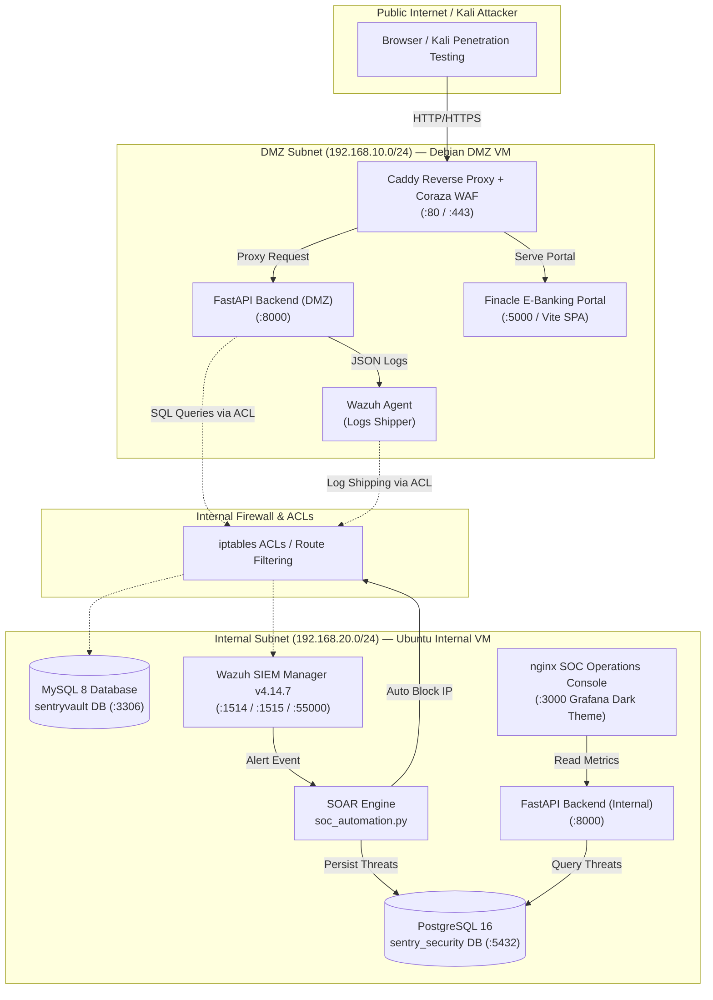
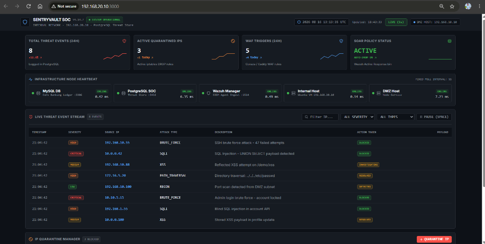
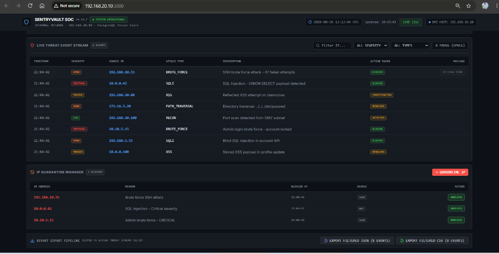
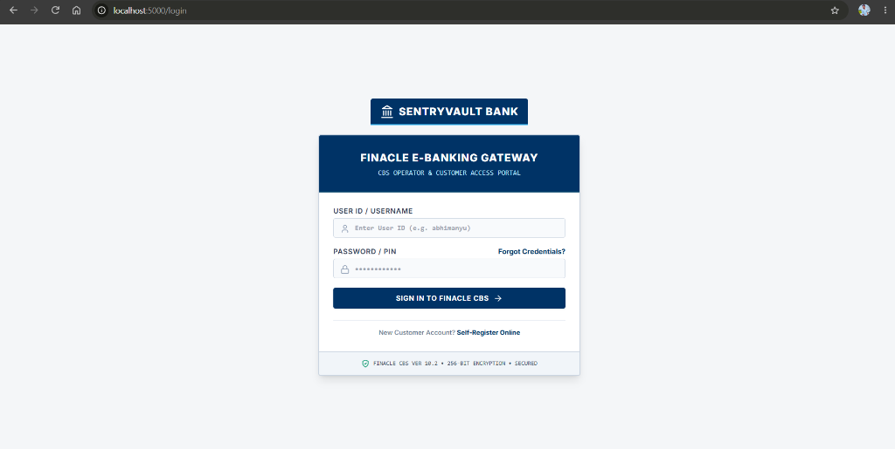
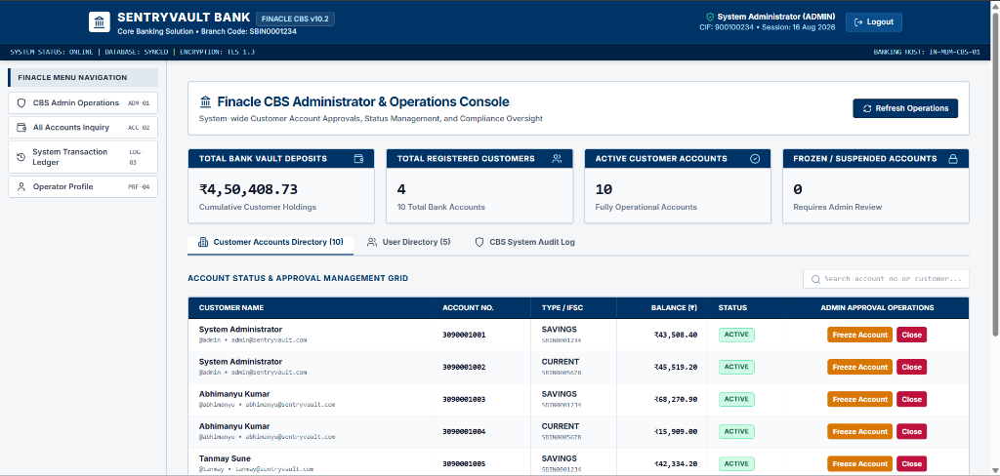
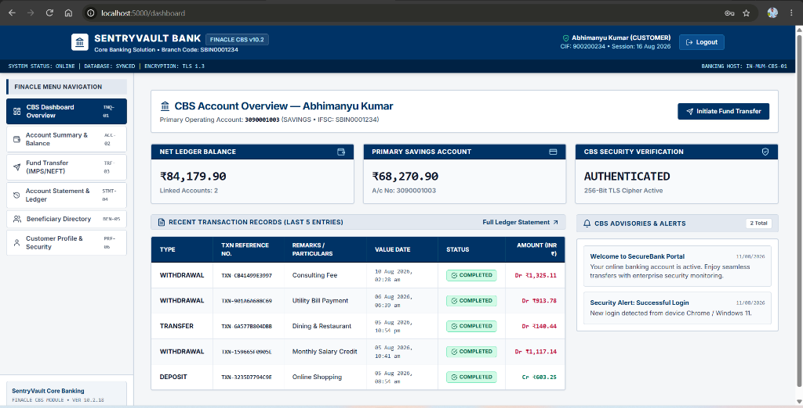

# SentryVault — Enterprise Secure Banking Portal & SOC Operations Lab

[](https://fastapi.tiangolo.com)
[](https://vitejs.dev)
[](https://mysql.com)
[](https://postgresql.org)
[](#-wazuh-siem--active-response)
[](https://nginx.org)
[](LICENSE)

**SentryVault** is an enterprise-grade core banking application combined with a dedicated **Security Operations Center (SOC) Command Console**. It operates across a segmented multi-VM DMZ layout featuring Caddy reverse proxy, Coraza Web Application Firewall (WAF), Suricata NIDS, centralized Wazuh SIEM, and automated SOAR incident response.

---

## 📖 Table of Contents

- [What is SentryVault?](#-what-is-sentryvault)
- [Live Network Architecture](#-live-network-architecture)
- [Application Suite & Interface Previews](#-application-suite--interface-previews)
  - [1. Grafana Dark SOC Command Console](#1-grafana-dark-soc-command-console)
  - [2. Live Threat Stream & IP Quarantine Manager](#2-live-threat-stream--ip-quarantine-manager)
  - [3. Finacle E-Banking Login Gateway](#3-finacle-e-banking-login-gateway)
  - [4. Finacle CBS Administrator & Operations Console](#4-finacle-cbs-administrator--operations-console)
  - [5. Customer Banking Overview Dashboard](#5-customer-banking-overview-dashboard)
- [VM Topology & Network Boundaries](#-vm-topology--network-boundaries)
- [Key Security Features](#-key-security-features)
- [Tech Stack](#-tech-stack)
- [Database Schemas](#-database-schemas)
- [Wazuh SIEM & SOAR Automation](#-wazuh-siem--soar-automation)
- [API Reference](#-api-reference)
- [Deployment Guide](#-deployment-guide)
- [Project Structure](#-project-structure)

---

## 🏦 What is SentryVault?

**SentryVault** is a **production-style, full-stack cybersecurity lab** built around a realistic core banking portal (Finacle E-Banking Suite). It demonstrates end-to-end enterprise security architecture across a segmented multi-VM network — strictly separating public-facing web applications in the DMZ from internal security monitoring, databases, and SOAR automation in the internal network.

> [!NOTE]
> Demonstrates **real-world DevSecOps & Security Operations skills**: network segmentation, firewall ACLs, SIEM telemetry integration, WAF enforcement, SOAR automation, and high-density dark-theme operations monitoring.

---

## 🌐 Live Network Architecture

The architecture enforces zero-trust principles, isolating public-facing services in a **DMZ Subnet (`192.168.10.0/24`)** while protecting sensitive databases, SIEM managers, and internal tools inside an **Internal Subnet (`192.168.20.0/24`)**.



---

## 🖥️ Application Suite & Interface Previews

### 1. Grafana Dark SOC Command Console
Located at `http://192.168.20.10:3000` on the **Internal Server**:



- **High-Density Dark Design**: `#0d1117` near-black canvas, `#161b22` panel containers, and `#2a2e37` subtle borders.
- **Top Bar**: System status pill (`SYSTEM OPERATIONAL`), live UTC clock, auto-refresh toggle (`LIVE 5s`), and DMZ host status indicator.
- **4 Metric Cards with SVG Sparklines**: Total Threat Events (24h), Active Quarantined IPs, WAF Triggers, and SOAR Policy Status.
- **Infrastructure Heartbeat Strip**: Real-time ping/TCP latency in ms for **MySQL DB**, **PostgreSQL SOC**, **Wazuh Manager**, **Internal Host**, and **DMZ Host**. Hovering reveals popover micro-charts of recent latency history.

---

### 2. Live Threat Stream & IP Quarantine Manager
Located on the lower panel of the SOC Command Console:



- **Live Threat Event Stream**: Real-time log table featuring Spacebar pause shortcut, inline search filter by IP/severity/attack type, and raw JSON alert payload inspector.
- **IP Quarantine Manager**: Active table of quarantined IPs (`192.168.10.55`, `10.0.0.42`, `10.10.5.15`), block reasons (SSH Brute Force, SQL Injection), timestamps, and inline 2-step confirmation **UNBLOCK** action.
- **Scoped Export Bar**: Filter-aware JSON and CSV export pipeline.

---

### 3. Finacle E-Banking Login Gateway
Located at `http://localhost:5000/login` (DMZ Network):



- **Branded Authentication Gateway**: Finacle CBS Operator & Customer Access Portal with 256-bit TLS encryption indicator.
- **Role-Based Access**: Supports both Customer Access and CBS Administrator Access with signed security tokens.

---

### 4. Finacle CBS Administrator & Operations Console
Located at `http://localhost:5000/admin-dashboard` (DMZ Network):



- **Core Banking Metrics**: Vault Deposits (`₹4,50,408.73`), Total Customers (`4`), Active Accounts (`10`), and Suspended Accounts (`0`).
- **Customer Accounts Directory**: Account status management grid with real-time **Freeze Account** and **Close** operational controls.
- **System Audit Log**: Real-time administrative oversight log tracking account approvals and status changes.

---

### 5. Customer Banking Overview Dashboard
Located at `http://localhost:5000/dashboard` (DMZ Network):



- **Customer Account Ledger**: Net ledger balance (`₹84,179.90`) across linked savings and current accounts.
- **Transaction Records**: Detailed transaction history displaying transaction reference numbers, value dates, amounts, and completion status.
- **Fund Transfer Workflow**: Immediate IMPS/NEFT transfer trigger modal with beneficiary directory.
- **Security Advisories**: Live login alerts and security advisories.

---

## 🖥️ VM Topology & Network Boundaries

| VM Node | IP Address | Subnet | Dedicated Role & Services |
|---|---|---|---|
| **Debian DMZ VM** | `192.168.10.10` | `192.168.10.0/24` | • Caddy Reverse Proxy & Coraza WAF (`:80`, `:443`)<br>• Customer Core Banking Web Application (`:5000`)<br>• FastAPI DMZ Application Backend (`:8000`)<br>• Wazuh Log Collector Agent (`:1514`) |
| **Ubuntu Internal VM** | `192.168.20.10` | `192.168.20.0/24` | • MySQL 8 Application Database (`:3306`)<br>• PostgreSQL 16 SOC/Security Database (`:5432`)<br>• Wazuh SIEM Manager v4.14.7 (`:1514`, `:1515`, `:55000`)<br>• SOAR Threat Automation & iptables Auto-Block<br>• **Standalone Grafana Dark SOC Console (`:3000` / `:80`)** |

---

## 🔐 Key Security Features

| Component | Security Feature | Implementation Details |
|---|---|---|
| **WAF Protection** | Coraza WAF + OWASP CRS | Blocks SQLi, XSS, Path Traversal, and Command Injection at the Caddy edge proxy. |
| **Auth & Access Control** | JWT + RBAC | RS256 signed JWTs with bcrypt password hashing; strict `ADMIN` vs `CUSTOMER` roles. |
| **SIEM Telemetry** | Wazuh Manager v4.14.7 | Real-time JSON application log ingestion, file integrity monitoring (FIM), and rootkit analysis. |
| **SOAR Automation** | Automated IP Quarantine | `active_response_block.py` automatically blocks offending IPs via `iptables` upon High/Critical alerts (severity ≥ 8). |
| **Network ACLs** | Strict `iptables` Firewall | Scoped ACCEPT rules restricting internal MySQL (`:3306`) and Wazuh Manager (`:1514`) access strictly to DMZ IPs. |
| **Structured Logging** | Wazuh-Compatible JSON | All application actions, auth attempts, and transaction logs are output as structured JSON objects. |

---

## 🛠️ Tech Stack

| Layer | Technology | Version | Description |
|---|---|---|---|
| **Frontend** | React + Vite | 18.x / 5.x | Core Banking Portal SPA + Grafana Dark SOC Console |
| **Styling** | TailwindCSS + Custom Dark System | 3.x | Custom Grafana dark design system (`#0d1117` / `#161b22`) |
| **Backend** | FastAPI + uvicorn | 0.10x | Async REST API, JWT auth, Pydantic schemas |
| **App DB** | MySQL 8 | 8.x | `sentryvault` DB (users, accounts, transactions) |
| **Security DB** | PostgreSQL 16 | 16.x | `sentry_security` DB (threats, blocked IPs, WAF alerts) |
| **SIEM** | Wazuh Manager | **v4.14.7** | Real-time log collector & alert correlation engine |
| **SOAR Engine** | Python 3 + psycopg2 | 3.12 | Automated iptables DROP blocker + PostgreSQL writer |
| **Serving** | Nginx | 1.24 | Internal SOC Console serving on ports 80 & 3000 |

---

## 🗄️ Database Schemas

### MySQL — `sentryvault` (Application DB)
```sql
users           (id, username, email, hashed_password, full_name, phone, role, is_active)
accounts        (id, user_id, account_number, account_type, balance, currency, ifsc_code, status)
transactions    (id, transaction_ref, source_account_id, target_account_id, amount, type, status)
beneficiaries   (id, user_id, name, account_number, bank_name, ifsc_code, nickname)
audit_logs      (id, user_id, action, ip_address, user_agent, details, created_at)
```

### PostgreSQL — `sentry_security` (SOC / SOAR DB)
```sql
threat_events   (id, source_ip, threat_type, severity, description, timestamp, raw_alert, status)
blocked_ips     (id, ip_address, reason, blocked_at, threat_event_id, active, block_source)
waf_alerts      (id, source_ip, target_url, attack_type, payload, severity, detected_at, blocked)
soc_metrics     (id, metric_name, metric_value, recorded_at)
```

---

## 📡 Wazuh SIEM & SOAR Automation

Wazuh Manager **v4.14.7** runs on the Internal VM (`192.168.20.10`) listening on:
- `1514` TCP/UDP — Log shipping
- `1515` TCP — Agent registration
- `55000` TCP — Wazuh REST API

```
Wazuh Manager Alert (Severity ≥ 8)
              │
              ▼
    active_response_block.py
              │
              ├── iptables -I INPUT 1 -s <IP> -j DROP
              │
              └── soc_automation.py --alert '<JSON>'
                      │
                      └── PostgreSQL: INSERT threat_events + blocked_ips
```

---

## ⚡ SOAR Automation CLI

[`scripts/soc_automation.py`](scripts/soc_automation.py) controls security workflows:

```bash
# Test PostgreSQL connectivity + write
python3 scripts/soc_automation.py --test

# List recent threat events
python3 scripts/soc_automation.py --list-threats

# List currently blocked IPs
python3 scripts/soc_automation.py --list-blocked

# Manually block an IP (iptables + DB)
python3 scripts/soc_automation.py --block-ip 192.168.10.99 --reason "SQLi Attack"

# Unblock an IP
python3 scripts/soc_automation.py --unblock-ip 192.168.10.99
```

---

## 📚 API Reference

Base URL: `http://<HOST>:8000/api/v1`

| Method | Endpoint | Auth Scope | Description |
|---|---|---|---|
| `POST` | `/auth/login` | Public | Obtain JWT token |
| `POST` | `/auth/register` | Public | Create new customer account |
| `GET` | `/accounts/` | Authenticated | List user accounts |
| `GET` | `/accounts/{id}` | Authenticated | Account details |
| `POST` | `/transactions/transfer` | Authenticated | Execute fund transfer |
| `GET` | `/transactions/` | Authenticated | Search transaction history |
| `GET` | `/soc/threats` | 🔐ADMIN | Paginated threat events stream (PostgreSQL) |
| `GET` | `/soc/blocked-ips` | 🔐ADMIN | List active quarantined IPs |
| `POST` | `/soc/block-ip` | 🔐ADMIN | Quarantine IP (PostgreSQL + iptables DROP) |
| `POST` | `/soc/unblock-ip` | 🔐ADMIN | Remove IP from quarantine |
| `GET` | `/soc/waf-alerts` | 🔐ADMIN | Coraza/Caddy WAF alert log |
| `GET` | `/soc/health-check` | Public | TCP socket & ping tests for all nodes |
| `GET` | `/soc/banking-kpis` | 🔐ADMIN | Security & system metric counts |

---

## 🚀 Deployment Guide

### Option 1: Multi-VM Production Layout

```bash
# 1. Setup Debian DMZ VM (192.168.10.10)
git clone https://github.com/abhienix/SentryVault.git
cd SentryVault/deployment
sudo bash setup_debian_dmz_vm.sh

# 2. Setup Ubuntu Internal VM (192.168.20.10)
git clone https://github.com/abhienix/SentryVault.git
cd SentryVault/deployment
sudo bash setup_internal_server.sh

# 3. Verify Subnet Reachability
ping -c 3 192.168.10.10
mysql -u sentryuser -pSecureDbPassword123! -h 192.168.20.10 sentryvault -e "SELECT 1;"
```

### Option 2: Local Docker Compose (Development)

```bash
git clone https://github.com/abhienix/SentryVault.git
cd SentryVault
cp .env.example .env
docker-compose up -d --build
docker-compose exec backend python scripts/seed_data.py
```

- **Internal SOC Console**: `http://localhost:3000` (or `http://localhost`)
- **FastAPI Documentation**: `http://localhost:8000/docs`

---

## 📁 Project Structure

```text
SentryVault/
├── docs/images/                # Interface screenshots for README
│   ├── soc_dashboard.png
│   ├── soc_quarantine.png
│   ├── login_gateway.png
│   ├── admin_console.png
│   └── customer_dashboard.png
│
├── backend/                    # FastAPI Application
│   ├── app/
│   │   ├── api/routers/        # Auth, Accounts, Transactions, Admin, SOC
│   │   ├── core/               # Configuration, Security, Logging
│   │   ├── database/           # MySQL session & PostgreSQL soc_session
│   │   ├── models/             # SQLAlchemy ORM database models
│   │   └── schemas/            # Pydantic validation schemas (soc.py)
│   ├── alembic/                # Database migrations
│   └── requirements.txt
│
├── frontend/                   # React + Vite Application
│   └── src/
│       ├── components/soc/     # Grafana dark components (TopBar, Cards, Stream, Quarantine)
│       ├── pages/              # SOCDashboard.jsx, Login.jsx, AdminDashboard.jsx, Dashboard.jsx
│       ├── services/           # socService.js (Axios API client)
│       └── styles/             # soc-grafana.css (#0d1117 dark design system)
│
├── database/
│   ├── init.sql                # MySQL schema init
│   └── sentry_security_schema.sql  # PostgreSQL SOC DB schema
│
├── scripts/
│   ├── seed_data.py            # MySQL data seeder
│   ├── soc_automation.py       # SOAR CLI engine (iptables + PostgreSQL)
│   └── active_response_block.py # Wazuh Active Response blocker
│
├── deployment/
│   ├── setup_internal_server.sh # Master Internal VM setup
│   ├── setup_debian_dmz_vm.sh   # DMZ VM setup
│   └── caddy-debian-dmz.Caddyfile
│
├── docker-compose.yml
└── README.md
```

---

<div align="center">

**SentryVault DevSecOps Lab · Built for Security Operations & Cybersecurity Demonstration**  
FastAPI · React · MySQL 8 · PostgreSQL 16 · Wazuh v4.14.7 · Nginx · SOAR

**Maintained by [@abhienix](https://github.com/abhienix)**

</div>
