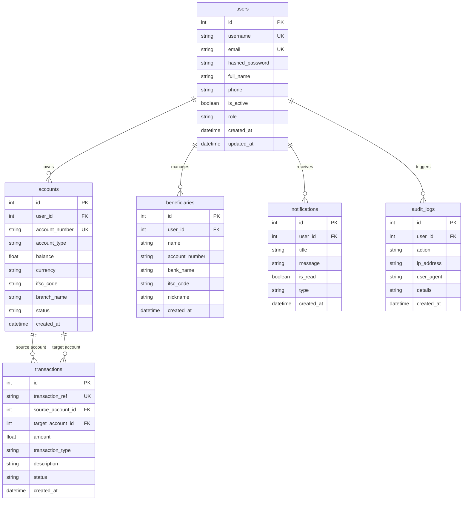

# SecureBank Portal - Database Architecture

Database Engine: **MySQL 8.0**
ORM: **SQLAlchemy 2.0**
Migrations: **Alembic**

---

## Entity Relationship Diagram (ERD)

---

## Tables Overview

### 1. `users`
- Primary Table storing authentication credentials and profile information.
- Password hashes use **bcrypt** cost factor 12.
- Roles: `ADMIN`, `CUSTOMER`.

### 2. `accounts`
- Financial accounts tied to a user.
- Account types: `SAVINGS`, `CURRENT`.
- Account numbers: Unique 10-digit format (`3090001001`).

### 3. `transactions`
- Financial ledger records.
- Foreign keys link to `source_account_id` and `target_account_id`.
- Composite Index: `idx_transaction_search (created_at, amount)`.

### 4. `beneficiaries`
- Address book of transfer recipients created by users.

### 5. `notifications`
- In-app alerts (Transaction alerts, security notices, system info).

### 6. `audit_logs`
- Security event logging (Logins, password changes, fund transfers, configuration updates).
